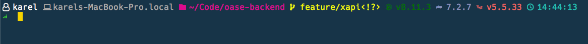
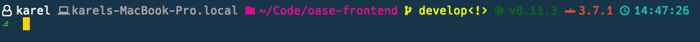

# Fancy Prompt

## Screenshots




## Installation

- use a [Nerd Font](https://github.com/ryanoasis/nerd-fonts) in your terminal
- run `wget https://s3-eu-west-1.amazonaws.com/bgr-assets/prompt/builds/fancy-prompt && sudo mv fancy-prompt /usr/local/bin/fancy-prompt && sudo chmod +x /usr/local/bin/fancy-prompt`
- add following lines to .zshrc
```zsh
FANCY_PROMPT_SYMBOL=$'\uf95c'
PROMPT='%(?.%F{green}.%F{red})${FANCY_PROMPT_SYMBOL}%f '
precmd() { /Users/karel/go/bin/FANCY_PROMPT }
```

## Configuration

- options should be exported in your .zshrc e.g. `export FANCY_PROMPT_GIT_COLOR=#ff0000`
- you can enable/disable/order segments by exporting the `FANCY_PROMPT_PARTS` variable
- colors are expected as HEX
- icons can be text or [Nerd Font codepoints](https://nerdfonts.com/#cheat-sheet)

### Default configuration

```zsh
FANCY_PROMPT_PARTS="user hostname path git node php laravel ember time"
FANCY_PROMPT_PATH_COLOR=#DD098F 
FANCY_PROMPT_PATH_ICON=\ue5ff  
FANCY_PROMPT_USER_COLOR=#ffffff
FANCY_PROMPT_USER_ICON=\uf2c0
FANCY_PROMPT_EMBER_COLOR=#DF4E39 
FANCY_PROMPT_EMBER_ICON=\ue71b  
FANCY_PROMPT_GIT_COLOR=#f4ff01+
FANCY_PROMPT_GIT_ICON=\ue725
FANCY_PROMPT_GIT_LEFT_BRACKET=\uf104
FANCY_PROMPT_GIT_RIGHT_BRACKET=\uf105
FANCY_PROMPT_GIT_UNTRACKED_ICON=?
FANCY_PROMPT_GIT_MODIFIED_ICON=!
FANCY_PROMPT_GIT_DELETED_ICON=x
FANCY_PROMPT_GIT_STAGED_ICON=+
FANCY_PROMPT_ARROW_DOWN=⇣
FANCY_PROMPT_ARROW_UP=⇡
FANCY_PROMPT_NODE_COLOR=#036E00 
FANCY_PROMPT_NODE_ICON=\ue718  
FANCY_PROMPT_HOSTNAME_COLOR=#AAAAAA 
FANCY_PROMPT_HOSTNAME_ICON=\uf109  
FANCY_PROMPT_LARAVEL_COLOR=#F46460 
FANCY_PROMPT_LARAVEL_ICON=\ue73f  
FANCY_PROMPT_PHP_COLOR=#8892BF 
FANCY_PROMPT_PHP_ICON=\ue73d  
FANCY_PROMPT_TIME_COLOR=#25BDB1 
FANCY_PROMPT_TIME_ICON=\uf64f 
```