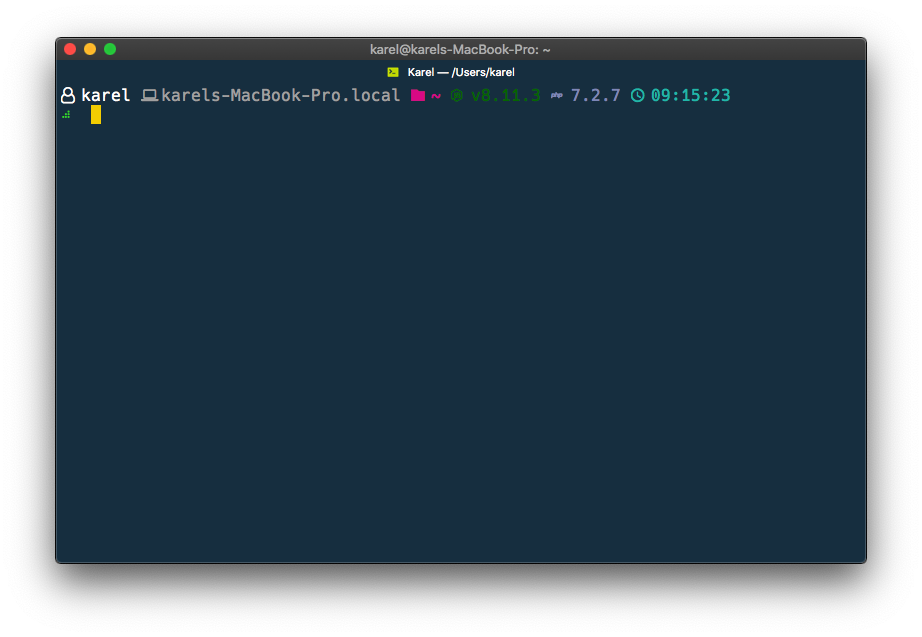

# Fancy Prompt

> A pretty fast ZSH prompt written in Go

## Features

- Hostname
- Username
- Path
- Git branch & status
- NodeJS version
- PHP version
- Laravel version
- Ember version

## Screenshots



## Installation

### Macos

- use a [Nerd Font](https://github.com/ryanoasis/nerd-fonts) in your terminal
- run `curl https://s3-eu-west-1.amazonaws.com/bgr-assets/prompt/builds/fancy-prompt-macos -o /usr/local/bin/fancy-prompt && chmod +x /usr/local/bin/fancy-prompt`
- add following lines to .zshrc
```zsh
export FANCY_PROMPT_SYMBOL=$'\uf95c'
PROMPT='%(?.%F{green}.%F{red})${export FANCY_PROMPT_SYMBOL}%f '
precmd() { /usr/local/bin/fancy-prompt }
```

### Linux

- use a [Nerd Font](https://github.com/ryanoasis/nerd-fonts) in your terminal
- run `curl https://s3-eu-west-1.amazonaws.com/bgr-assets/prompt/builds/fancy-prompt-linux -o /usr/local/bin/fancy-prompt && chmod +x /usr/local/bin/fancy-prompt`
- add following lines to .zshrc
```zsh
export FANCY_PROMPT_SYMBOL=$'\uf95c'
PROMPT='%(?.%F{green}.%F{red})${export FANCY_PROMPT_SYMBOL}%f '
precmd() { /usr/local/bin/fancy-prompt }
```

## Configuration

- options should be exported in your .zshrc e.g. `export FANCY_PROMPT_GIT_COLOR=#ff0000`
- you can enable/disable/order segments by setting `export FANCY_PROMPT_PARTS=path,git,ember` for example
- colors are expected as HEX
- icons can be text or [Nerd Font codepoints](https://nerdfonts.com/#cheat-sheet)

### Default configuration

```zsh
export FANCY_PROMPT_PARTS="user hostname path git node php laravel ember time"
export FANCY_PROMPT_SEPARATOR= 
export FANCY_PROMPT_PATH_COLOR=#DD098F 
export FANCY_PROMPT_PATH_ICON=\ue5ff  
export FANCY_PROMPT_USER_COLOR=#ffffff
export FANCY_PROMPT_USER_ICON=\uf2c0
export FANCY_PROMPT_EMBER_COLOR=#DF4E39 
export FANCY_PROMPT_EMBER_ICON=\ue71b  
export FANCY_PROMPT_GIT_COLOR=#f4ff01
export FANCY_PROMPT_GIT_ICON=\ue725
export FANCY_PROMPT_GIT_LEFT_BRACKET=\uf104
export FANCY_PROMPT_GIT_RIGHT_BRACKET=\uf105
export FANCY_PROMPT_GIT_UNTRACKED_ICON=?
export FANCY_PROMPT_GIT_MODIFIED_ICON=!
export FANCY_PROMPT_GIT_DELETED_ICON=x
export FANCY_PROMPT_GIT_STAGED_ICON=+
export FANCY_PROMPT_ARROW_DOWN=⇣
export FANCY_PROMPT_ARROW_UP=⇡
export FANCY_PROMPT_NODE_COLOR=#036E00 
export FANCY_PROMPT_NODE_ICON=\ue718  
export FANCY_PROMPT_HOSTNAME_COLOR=#AAAAAA 
export FANCY_PROMPT_HOSTNAME_ICON=\uf109  
export FANCY_PROMPT_LARAVEL_COLOR=#F46460 
export FANCY_PROMPT_LARAVEL_ICON=\ue73f  
export FANCY_PROMPT_PHP_COLOR=#8892BF 
export FANCY_PROMPT_PHP_ICON=\ue73d  
export FANCY_PROMPT_TIME_COLOR=#25BDB1 
export FANCY_PROMPT_TIME_ICON=\uf64f 
```